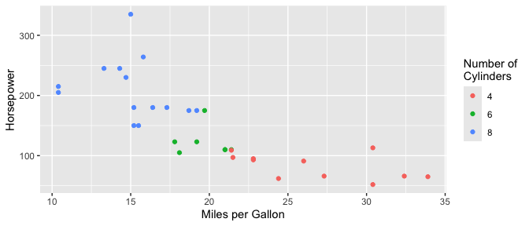
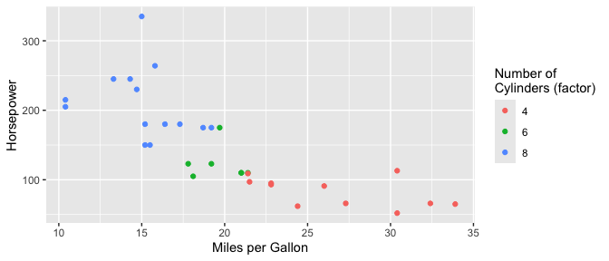

<!-- README.md is generated from README.Rmd. Please edit that file -->

# nicknames 

<!-- badges: start -->

[](https://github.com/jansim/nicknames/actions/workflows/R-CMD-check.yaml)
<!-- badges: end -->

Nicknames allows you to specify human readable names for the columns in
your data once and then reuse them across your project to rename plots
axes, dataframe columns, tables and anything else.

## Installation

You can install the development version of nicknames from
[GitHub](https://github.com/) with:

``` r
# install.packages("pak")
pak::pak("jansim/nicknames")
```

## Example

With nicknames, you can register the mapping between columns in your
data and human readable column names once and easily re-use them
everywhere.

``` r
library(nicknames)

nn_register(c(
  "mpg" = "Miles per Gallon",
  "hp" = "Horsepower",
  "cyl" = "Number of\nCylinders"
))
```

Including ggplot2 plots…

``` r
library(ggplot2)

# Create plot and apply nickname labels
ggplot(mtcars, aes(x = mpg, y = hp, color = factor(cyl))) +
  geom_point() +
  labs_nn()
```



…dataframes…

``` r
library(dplyr)

mtcars |>
  select(mpg, hp, cyl) |>
  nn() |>
  head()
#>                   Miles per Gallon Horsepower Number of\nCylinders
#> Mazda RX4                     21.0        110                    6
#> Mazda RX4 Wag                 21.0        110                    6
#> Datsun 710                    22.8         93                    4
#> Hornet 4 Drive                21.4        110                    6
#> Hornet Sportabout             18.7        175                    8
#> Valiant                       18.1        105                    6
```

…and column names directly.

``` r
nn("mpg")
#> [1] "Miles per Gallon"
```

While variables names are extracted from within function calls
(e.g. `factor(cyl)` above), more exact matches take priority if you need
to be precise.

``` r
nn_register(c(
  "factor(cyl)" = "Number of\nCylinders (factor)"
))

ggplot(mtcars, aes(x = mpg, y = hp, color = factor(cyl))) +
  geom_point() +
  labs_nn()
```


